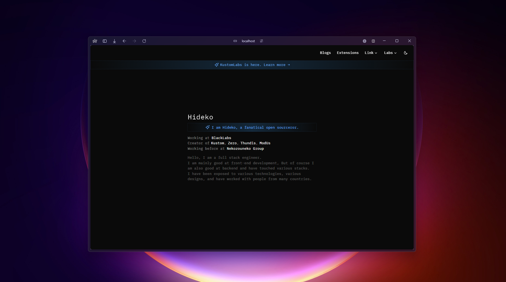
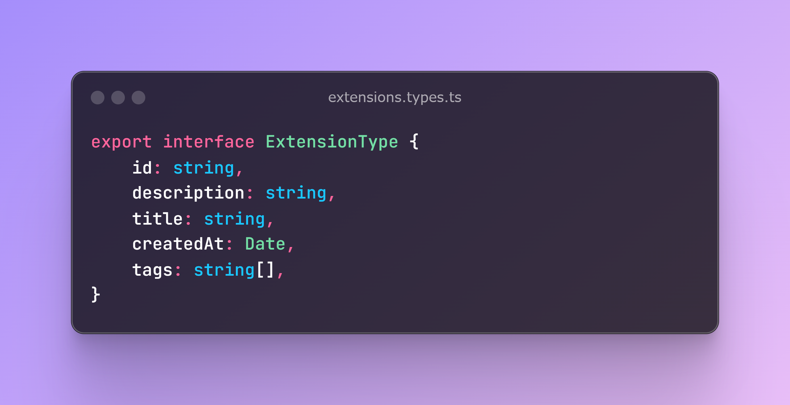
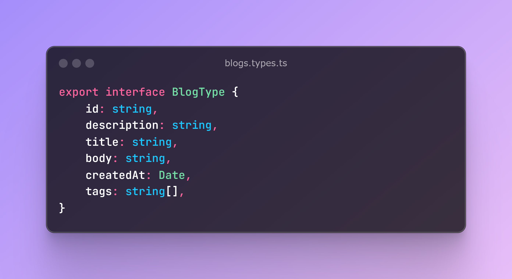

# Hideko's Portfolio

``` Portfolio ``` https://hideko.rest



## Stacks

- [SvelteKit](https://kit.svelte.dev) - A fast and easy framework.
- [TailwindCSS](https://tailwindcss.com) - CSS framework for rapid coding.
- [Shadcn-Svelte](https://shadcn-svelte.com) - The one that can use shadcn/ui in Svelte.
- [Iconify](https://iconify.design) - Icons to be used from the cloud server.

## Structures

```text
$root
│
├── src  #Source codes
│    └── lib  #Global library
│        ├── assets  #My assets, icons, etc.
│        └── components  #my custom components
│            └── ui  #shadcn/ui components
│    └── routes  #Directory routing
│ 
└── static  #Static files such as favicon and robots.txt
```

## Types




## License

**MIT License.**

You may fork and use my project without notification, provided you adhere to the following conditions.

- Add a link to [this repository](https://github.com/hideko-dev/portfolio)

Check out [LICENSE](./LICENSE) for more detail.